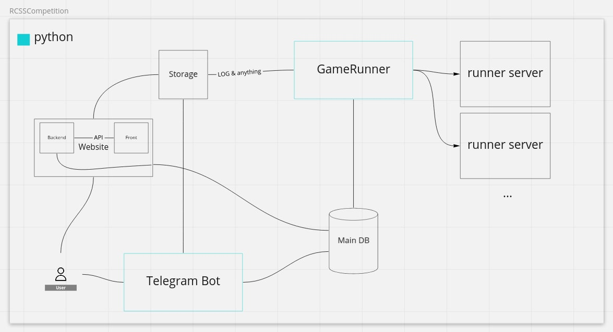

# SS2D-Docker-Tournament-Runner

This is a Docker-based tool for running SS2D games and holding tournaments.

## Requirements

To run properly, you need JQ and Docker.

* jq

    ```console
    sudo apt-get install jq
    ```

* docker

    <https://docs.docker.com/engine/install/ubuntu/>

after installing the requirements, we have some config to make

## quick-start

You need to make a .env file from .env.example.
This dot-env file is for Telegram bot config, If you don't want to use Telegram leave it without any change.

```bash
cp .env.example .env
```

build docker files:

```console
./build_all.sh
```

After buliding test teams, servers, and tournament networks, Copy your teams binaries to `./bins/team_name/bin/`  
teamname should be lowercase due to docker's restrictions.

```console
#EXAMPLE
./bins/agent/bin/
./bins/yushan2022/bin/
./bins/cyrus2d/bin
```

Each binary should have a start file (only run one player).  
The start file should get three arguments: IP, path, and number  
An example of a start file is in the `start_files` folder.  
You can test your start file locally with `localStartAll` in the `start_files` folder.

bulid your team for docker

```console
./build_team.sh -n team_name 
```

`team_name` is the lower case folder name

to run a single game, you can use

```console
./run_game.sh -st starter|major -gt  league|cup|test -ld log_dir -ed event_dir -l left_team -r right_team -n network
```

You can run a test game to be sure that everything is working.

1. Make a directory for logs and servers!

    ```console
    mkdir -p ./tmp/logdir
    mkdir -p ./tmp/server_directory
    ```

2. Init the test servers (create networks and files).

    ```bash
    ./run_test.sh -in -sd "./tmp/server_directory"
    ```

3. Run it with test binaries.

    ```bash
    ./run_test.sh -sd "`pwd`/tmp/server_directory" -ld "`pwd`/tmp/logdir" -ed "`pwd`/tmp/log_directory" -ltbl "`pwd`/bins/y" -ec "ls LOG_DIR EVENT_DIR"
    ```

## Full Explanation

You must be able to run a single game or a test game with the docker-runner.
If you want more configs and know how to do other things; Welcome to the full explanation section.

***let's start***

## Configs

### Docker Networks Config

Inside the `configs` folder, you can create new networks and servers to run games on them.  
To do this, you need to add some variables to your `server_name` file.  
Each config file contains these variables:

`server1` file:

```bash
SERVER_NAME=server1
SERVER_SUBNET=172.11.0.0/16
SERVER_IP=172.11.0.111
SERVER_PORT=6100
LEFT_FIRST_CORE=5
LEFT_LAST_CORE=12
RIGHT_FIRST_CORE=13
RIGHT_LAST_CORE=20
LEFT_TEAM_RAM_LIMIT=2g
RIGHT_TEAM_RAM_LIMIT=2g
```

`SERVER_NAME` is used to build a network with a given name to use later for running games.  
`SERVER_SUBNET` and `SERVER_IP`, and `SERVER_PORT` are required to create different networks for teams and rcssserver.  
`LEFT_FIRST_CORE` and `LEFT_LAST_CORE` indicate the number of cores that can be used by the left team.  
`RIGHT_FIRST_CORE` and `RIGHT_LAST_CORE` indicate the number of cores that can be used by the left team.  
`LEFT_TEAM_RAM_LIMIT` and `RIGHT_TEAM_RAM_LIMIT` specifies the memory limit for the left and right team, respectively.

### dot-env file

There is a dot-env.example in the main directory. Make a copy of it and fill in the blanks.  
This dot-env file is for telegram bot config. If you don't want to use Telegram, change ones to zeros and leave the rest.

```env
BOT_TOKEN=
PUBLIC_CHANNEL_ID=
PRIVATE_CHANNEL_ID=
ALERT_CHANNEL_ID=
UPLOAD_LOG_BY_TELEGRAM=0
UPLOAD_OUT_BY_TELEGRAM=0
SEND_ALERT_BY_TELEGRAM=0
SEND_PUBLIC_BY_TELEGRAM=0
SEND_PRIVATE_BY_TELEGRAM=0
SEND_GAME_CHANGES=0
```

## Team Uploads

There are three ways to upload binaries.

1. Manual upload
2. Upload via telegram bot
3. Upload via website

### Manual upload

After you receive (one or many) binaries by any other ways like email, flash drive, or local networks, Copy binaries to ./bins/team_name/bin/

```console
#EXAMPLE
./bins/agent/bin/  
./bins/yushan/bin/ 
```

Each binary should have a start file (only run one player).  
The start file should get three arguments: IP, path, and number  
An example of a start file is in the `start_files` folder.  
Participants can test their start file locally with `localStartAll` in the `start_files` folder.

### Telegram Bot

This Telegram bot will grant participants options and the ability to upload and test their binaries.
There are three types of users for this Bot, admin, team-leader, and normal-user.

Each Telegram user can use the `/start` command line or simply click the start button on the Bot (private|direct) page, and the Bot will welcome the user and send the user some options according to their type to interact with the Bot.

Admins can see, add, remove and reset a team and open or close the binary upload window to give team-leaders access to upload a binary for the round or not.  
Team leaders can upload, receive and test their binary.  
Everyone is a normal user at the start and can access other types simply by registering with given passwords and usernames as an admin or a team leader.  

Team-leader can send(upload) a tar.gz or tar.xz file of their binary to the Bot.
The Bot will alert the user that the binary has been saved in the server; we will run a test game and send the results back to you.
After successfully extracting the binary and checking all the parameters like team name, start file and etc., the Bot will save the user request in a queue to be executed as soon as a test server is free and ready to start testing a game.
Finally, after the test game is finished, Bot will compress logs and events as separate tar files and send them to the user with a tag that indicates the team name and binary unique-id and time-stamp. for example #team-name #627bdcf6d56b3014fd531ebc

**For more information about this telegram-bot and full documentation, please visit *UploaderTelegramBot* repo**



### Website

Website and Telegram bot use the same logic, making them very similar.
We are working on it, and we will update and document it as soon as it is ready.

## How to build docker images

You must build a docker image for each team and server if there are any changes or if this is your first time.  
Using build commands will delete previous builds and create a new one.  
After building everything, you are ready to run a game or a league.

*you can use `--help` on each builder command*

### build all teams, servers, and tournament networks at once

```console
./build_all.sh
```

### build one team

```console
./build_team.sh -n team_name 
```

`team_name` must be the same name as in the bins folder.

### build all teams

```console
./build_teams.sh
```

### build rcssserver

```console
./build_server.sh
```

It will build `rcssserver 17.0.1` in the server folder.  
You can change it by putting another version of the server and changing the Dockerfile in the server folder.

### build networks for tournament

```console
./build_network.sh
```

## How to run a test game

You can run a test game to be sure that everything is working.

1. Make a directory for logs and servers!

    ```console
    mkdir -p ./tmp/logdir
    mkdir -p ./tmp/server_directory
    ```

2. Init the test servers (create networks and files).

    ```bash
    ./run_test.sh -in -sd "./tmp/server_directory"
    ```

3. Run it with test binaries.

    ```bash
    ./run_test.sh -sd "`pwd`/tmp/server_directory" -ld "`pwd`/tmp/logdir" -ed "`pwd`/tmp/log_directory" -ltbl "`pwd`/bins/y" -ec "ls LOG_DIR EVENT_DIR"
    ```

## How to run a league group

### Prepare team list

First, you must indicate which teams are in your league.  
Put `team_name` in a file (`teams_list_file_name`) in the games folder; each line must contain only one name.

```console
#EXAMPLE file_name: a_group

yushan
helios
agent
cyrus
```

### Create a game list

Now you can use this command to generate a game list for that league group.

```shell
cd games
python game_list_maker.py teams_list_file_name group_name group_type game_type

#EXAMPLE
python game_list_maker.py a_group A major league
```

`group_type` must be `starter` or `major`

`game_type` can be `test` or `league` or `cup`

`test` game type is a short 300 cycle match between agent_base and all the teams.  
`league` game type is regular group games in which all teams play against each other (every two teams will play together at least one time).  
`cup` game type is the step leader mode in which team rank N plays against team rank (N-1), and the winner team will move up one step and play against rank (N-2) and so on.  

This command will generate a game list (`group_X_games`)  for that group so run_group.sh can read from and run games according to the list.

```console
#EXAMPLE  filename:group_A_games

helios yushan A major league
cyrus helios A major league
agent cyrus A major league
cyrus yushan A major league
agent helios A major league
agent yushan A major league
```

and now you are ready to run the game list

### Run game list files

To run a group game list (or a test list), you can use this command.

```console
./run_group.sh -n network -gl games_file -ld log_dir -ed event_dir

#EXAMPLE
./run_group.sh -n server1 -gl games/group_A_games -ld `pwd`/log -ed `pwd`/log
```

You can use the step ladder or cup type or runner-up mode with  `./run_stepladder.sh` instead of `./run_group.sh` (it will use the `winnerfinder.py` to find the winner of the last match to move that team one step up to run next match).

### Run a single game

to run a single game, you can use

```console
./run_game.sh -st starter|major -gt  league|cup|test -ld log_dir -ed event_dir -l left_team -r right_team -n network
```

If you are using a different system (online, cloud, or a different network), we suggest using a `screen` to run these commands to keep the league console open.

## How to use Screen

to install `screen`, use this command

```console
sudo apt install screen
```

To start a screen session, simply type `screen` in your console.  
Named sessions are useful when you run multiple screen sessions (for running multiple groups at once or breaking a large group to run on different servers).  
To create a named session, run the screen command with the `-S` argument:

```console
screen
OR
screen -S session_name

#EXAMPLE
screen -S server1
./run_group.sh -n server1 -gl games/group_A_games -ld `pwd`/log -ed `pwd`/event
```

Use the key sequence Ctrl-a + Ctrl-d to detach from the screen session.  
You can find the session ID list of the current running screen sessions with

```console
screen -ls

#EXAMPLE
There are screens on:
    13951.server1   (05/15/22 00:51:00)     (Detached)
    13904.pts-1.Dektop-LilyStatic   (05/15/22 00:49:54)     (Detached)
2 Sockets in /run/screen/S-mroa.
```

You can reattach to the screen session by typing screen -r.

```console
screen -r screen_id
OR
screen -r screen_name

#EXAMPLE
screen -r server1
```

You can find more helpful commands by typing `Ctrl+a ?` in a screen session.

## Kill a server

If there is a need to kill a server or network due to a mistake or run-time error, you can use the combined key (`ctrl-c`) to kill the command, and after that, use this command to kill the malfunctioning server or network.

```console
./kill_server.sh -n server_name

#EXAMPLE
./kill_server.sh -n server1
```

## Issues

Feel free to submit issues and enhancement requests.

Please use [Discord](https://discord.gg/yFxkCcatGe) to report specific bugs and errors.  
you can find us there

* [CYRUS] Nader Zare : naderzare#3664
* [CYRUS] Omid Amini : MROA#1608
* [OBG] Alireza Sadraii : Alireza Sadraii#1141

## Contributing

Please refer to each project's style and contribution guidelines for submitting patches and additions. In general, we follow the "fork-and-pull" Git workflow.

 1. **Fork** the repo on GitHub
 2. **Clone** the project to your own machine
 3. **Commit** changes to your own branch
 4. **Push** your work back up to your fork
 5. Submit a **Pull request** so that we can review your changes

NOTE: Be sure to merge the latest from "upstream" before making a pull request!

## Copyright and Licensing

We don't have any yet. But we will.

## README TODO

Hello, we are going to write more for this readme to become more useful for everyone! - mroa
  
* [x] Configs
* [x] Team Uploads
  * [ ] Telegram Bot - **Tested** - (*readme* in *UploaderTelegramBot* repo)
  * [ ] Website -  **Tested** - **in development** - (*readme* in *SS2DTR* repo)
  * [x] Manual Upload
  * [x] How to prepare binaries
    * [ ] what is prepare_team.sh (*not used*)

* [x] How to build
* [x] How to run
  * [x] What is run_group.sh
  * [x] What is run_stepladder.sh
  * [x] What is run_game.sh
  * [ ] What is run_penalty.sh (*not used*)
* [x] Copyright and Licensing
* [ ] Use badges  
  * for example  
        
